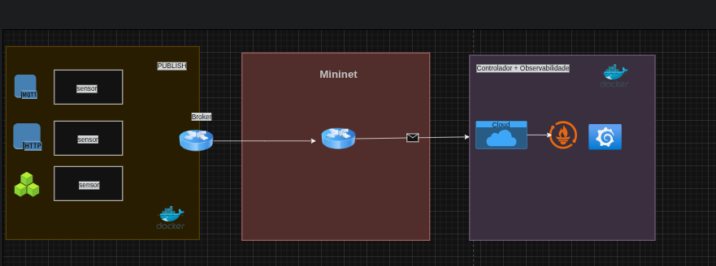

<h1 align="center"> IoT-DockerCity Project</h1>

Simulação e monitoramento de redes IoT heterogêneas em um ambiente de Smart City usando Mininet, Docker, Prometheus e Grafana.

---

---

## 📖 Overview

**IoT-DockerCity** permite modelar, emular e monitorar redes IoT heterogêneas em uma Smart City.

* Coleta de métricas de dispositivos IoT em tempo real.
* Visualização em dashboards interativos via Grafana.
* Emulação de condições de rede realistas usando Mininet + NetEm.

---

## 🏗️ Arquitetura

* **Dispositivos IoT:** modelados como contêineres Docker com capacidades variadas.
* **Controlador Central:** coleta métricas e dados dos dispositivos.
* **Monitoramento:** Prometheus coleta métricas; Grafana exibe dashboards.

---

## 🛠️ Technologies Used

    
    
    
    
    

## ⚡ Features

1. **IoT Device Modeling**

   * Configuração de CPU, RAM, armazenamento e interfaces de rede.
   * Aplicações com frequência de coleta, volume de dados e requisitos de latência.

2. **Network Emulation**

   * Topologias Mininet simulando latência, jitter e perda de pacotes.
   * Protocolo MQTT

3. **Centralized Monitoring**

   * Prometheus para coleta de métricas detalhadas.
   * Dashboards Grafana com alertas de sobrecarga ou falha.

4. **Containerized Environment**

   * Dispositivos e serviços isolados para escalabilidade e replicação.

---

## 📊 Datasets Recomendados

* [SmartSantander](https://smartsantander.eu/)
* [CityPulse](https://www.citypulse.eu/)
* [OpensenseMap](https://opensensemap.org)
* [NYC Open Data](https://opendata.cityofnewyork.us)

---

### 4. Acessar dashboards

* Prometheus: [http://localhost:9090](http://localhost:9090)
* Grafana: [http://localhost:3000](http://localhost:3000)

---

## 🧑‍💻 Authors

<a href="https://github.com/Julio-Caio"><b>Júlio Caio</b></a> 
<a href="https://github.com/JuliaSantss"><b>Júlia Beatriz</b></a>